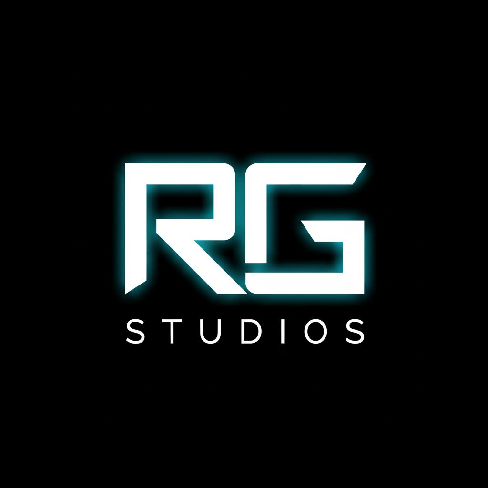

  

<h1 align="center">RG Studios</h1>

  A creative & technical studio focused on high-quality digital resources,
  structured systems, and clean, maintainable projects.

---

---

## 📌 Table of Contents
- [About](#about)
- [What We Do](#what-we-do)
- [Support](#support)
- [Contact](#contact)
- [Important Links](#important-links)
- [License](#license)

---

## About

RG Studios operates with a strong focus on **clarity, structure, and long-term quality**.

This repository is not intended to host production code.  
It exists as the **official public information hub** for RG Studios — including
support details, contact information, and verified links.

---

## What We Do

- Build structured digital tools & resources  
- Design clean systems and workflows  
- Focus on maintainability and documentation  
- Deliver intentional, well-defined projects  

Quality and simplicity guide everything at RG Studios.

---

## Support

Need help or have a question?

👉 See **[SUPPORT.md](SUPPORT.md)**

---

## Contact

For inquiries, collaborations, or professional communication:

👉 See **[CONTACT.md](CONTACT.md)**

---

## Important Links

All official RG Studios links are listed here:

👉 See **[LINKS.md](LINKS.md)**

---

## License

This repository is licensed under the **MIT License**.  
See the `LICENSE` file for details.
